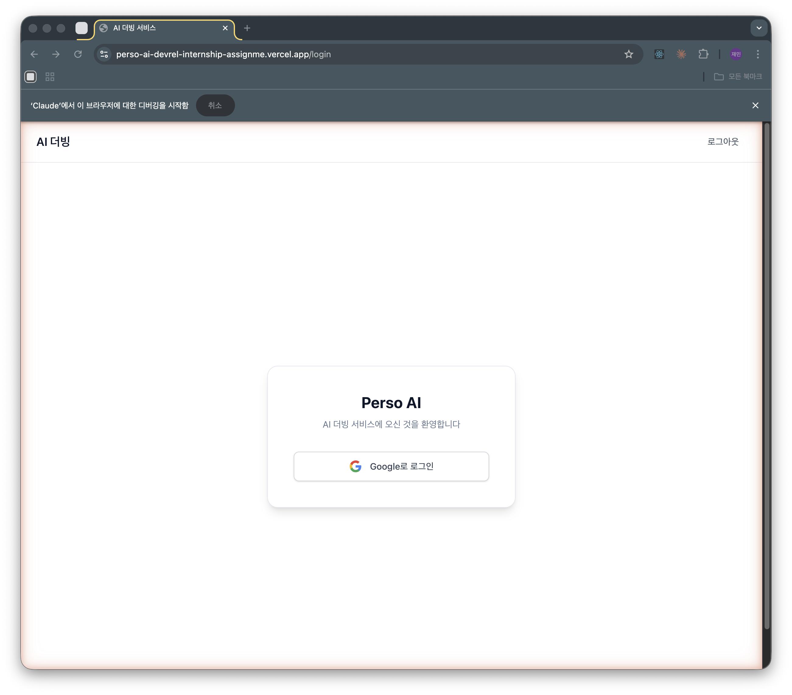
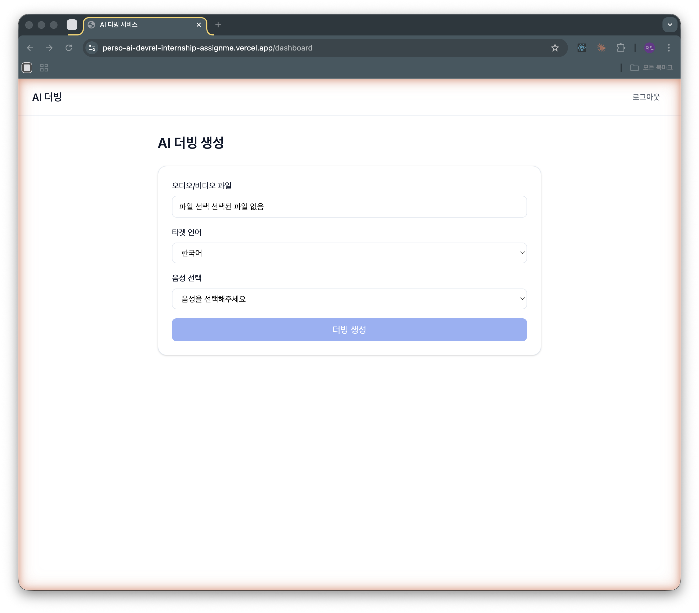
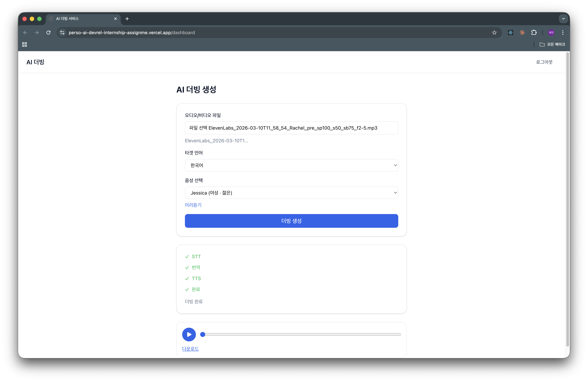
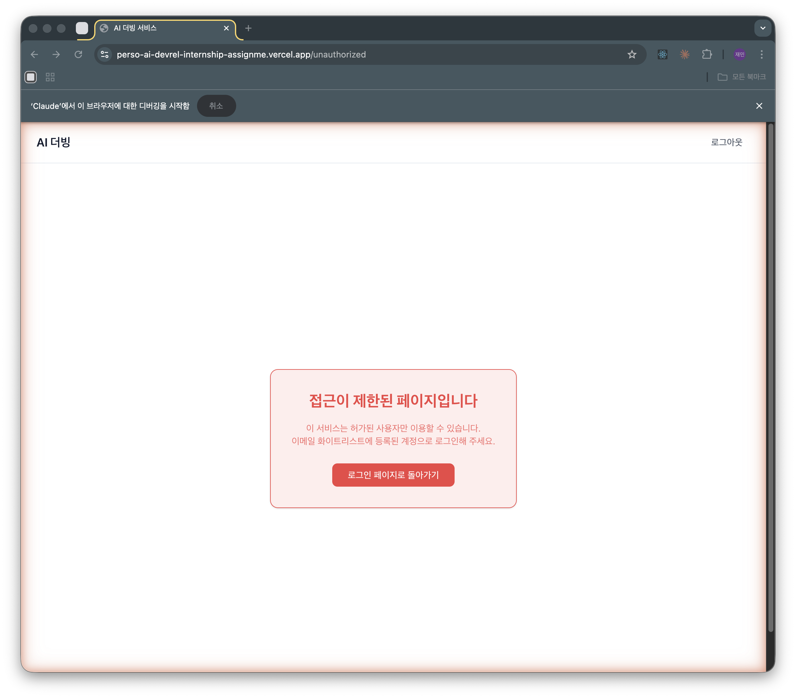

# Perso AI — AI 더빙 웹 서비스

> 오디오/비디오 파일을 업로드하면 원하는 언어로 AI가 자동으로 더빙해주는 웹 서비스

**배포 URL:** [https://perso-ai-devrel-internship-assignme.vercel.app](https://perso-ai-devrel-internship-assignme.vercel.app)

---

## 서비스 소개

Perso AI는 ElevenLabs API와 Google Gemini를 활용한 **AI 더빙 파이프라인**을 제공합니다. 오디오 또는 비디오 파일을 업로드하면 다음 3단계를 자동으로 처리합니다.

```
오디오/비디오 업로드 → STT (음성 → 텍스트) → 번역 → TTS (텍스트 → 음성) → 더빙 결과 다운로드
```

화이트리스트 기반 Google OAuth 로그인으로 인가된 사용자만 서비스를 이용할 수 있습니다.

---

## 주요 기능

| 기능                | 설명                                                |
| ------------------- | --------------------------------------------------- |
| AI 더빙 파이프라인  | 파일 업로드 → STT → 번역 → TTS → 결과 재생/다운로드 |
| 다국어 지원         | 한국어, 영어, 일본어, 중국어 등 다양한 언어 더빙    |
| 음성 선택           | ElevenLabs의 다양한 TTS 음성 중 선택 가능           |
| 실시간 진행 상태    | STT → 번역 → TTS 각 단계별 진행 상황 UI 표시        |
| 연속 더빙           | 새로고침 없이 연속으로 여러 파일 더빙 가능          |
| Google OAuth 로그인 | 화이트리스트 이메일 기반 접근 제어                  |

---

## 스크린샷

### 1. 로그인 페이지



### 2. AI 더빙 생성 대시보드




### 3. 접근 제한 페이지 (비인가 사용자)



---

## 기술 스택

### Frontend / Framework

| 기술         | 버전            | 용도              |
| ------------ | --------------- | ----------------- |
| Next.js      | 16 (App Router) | 풀스택 프레임워크 |
| React        | 19              | UI 라이브러리     |
| TypeScript   | 5               | 타입 안전성       |
| Tailwind CSS | 4               | 스타일링          |

### 인증 / 데이터베이스

| 기술                   | 용도                     |
| ---------------------- | ------------------------ |
| Auth.js v5 (next-auth) | Google OAuth 인증        |
| Turso (libSQL)         | 화이트리스트 이메일 저장 |

### AI / 외부 API

| API            | 용도               |
| -------------- | ------------------ |
| ElevenLabs STT | 음성 → 텍스트 변환 |
| ElevenLabs TTS | 텍스트 → 음성 합성 |
| Google Gemini  | 텍스트 번역        |

### 배포 / 테스트

| 기술   | 용도                              |
| ------ | --------------------------------- |
| Vercel | 자동 배포 (GitHub 푸시 시 트리거) |
| Vitest | 단위 테스트                       |

---

## 아키텍처

FSD(Feature-Sliced Design) 아키텍처를 적용해 코드를 레이어별로 체계적으로 구성했습니다.

```
src/
├── app/                          # Next.js App Router (얇은 라우팅)
│   ├── page.tsx                  # 루트 → /login 또는 /dashboard 리다이렉트
│   ├── login/page.tsx            # 로그인 페이지
│   ├── dashboard/page.tsx        # 더빙 대시보드
│   ├── unauthorized/page.tsx     # 접근 제한 페이지
│   └── api/                      # API Routes
│       ├── stt/route.ts          # ElevenLabs STT API
│       ├── translate/route.ts    # Gemini 번역 API
│       ├── tts/route.ts          # ElevenLabs TTS API
│       └── voices/route.ts       # ElevenLabs 음성 목록 API
├── features/
│   ├── dubbing-create/           # AI 더빙 생성 피처
│   │   ├── ui/                   # DubbingForm, PipelineProgress, AudioPlayer 등
│   │   ├── model/                # useDubbingCreate hook (비즈니스 로직)
│   │   └── lib/                  # 파일 유효성 검사, 파이프라인 상태 유틸
│   └── auth-login/               # 인증 피처
│       ├── ui/                   # LoginPage, GoogleLoginButton, UnauthorizedPage
│       └── lib/                  # 화이트리스트 확인, 보호 라우트 판별
├── entities/                     # 도메인 엔티티 (API 함수, DTO)
└── shared/                       # 공통 유틸리티 (Turso 클라이언트, CN, 환경변수)
```

---

## 로컬 실행 방법

### 사전 준비

다음 서비스에 가입하고 API 키를 발급받으세요.

| 서비스                                                   | 용도                   |
| -------------------------------------------------------- | ---------------------- |
| [ElevenLabs](https://elevenlabs.io)                      | STT/TTS API 키         |
| [Google Cloud Console](https://console.cloud.google.com) | OAuth Client ID/Secret |
| [Google AI Studio](https://aistudio.google.com)          | Gemini API 키          |
| [Turso](https://turso.tech)                              | 데이터베이스 URL/토큰  |

### 설치 및 실행

```bash
# 1. 저장소 클론
git clone https://github.com/jaeml06/Perso-AI-DevRel-Internship-Assignment.git
cd Perso-AI-DevRel-Internship-Assignment

# 2. 의존성 설치
npm install

# 3. 환경변수 설정
cp .env.example .env.local
# .env.local 파일을 열어 아래 값을 채우세요
```

### 환경변수 (.env.local)

```env
# ElevenLabs AI 더빙 API
ELEVENLABS_API_KEY=your_elevenlabs_api_key

# Google Gemini 번역 API
GEMINI_API_KEY=your_gemini_api_key

# Auth.js (next-auth v5)
AUTH_SECRET=your_random_secret          # openssl rand -base64 32
AUTH_GOOGLE_ID=your_google_client_id
AUTH_GOOGLE_SECRET=your_google_client_secret

# Turso 데이터베이스
TURSO_DATABASE_URL=libsql://your-db.turso.io
TURSO_AUTH_TOKEN=your_turso_auth_token
```

```bash
# 4. 개발 서버 실행
npm run dev
# → http://localhost:3000
```

### 화이트리스트 설정

로그인을 허용할 이메일을 Turso DB에 추가합니다.

```sql
-- Turso 콘솔 또는 CLI로 실행
CREATE TABLE IF NOT EXISTS whitelist (email TEXT PRIMARY KEY);
INSERT INTO whitelist (email) VALUES ('your-email@gmail.com');
```

---

## 배포 자동화

GitHub의 `main` 브랜치에 푸시하면 Vercel에 자동으로 Production 배포가 트리거됩니다.

```
git push origin main  →  Vercel 빌드 시작  →  Production 배포 완료 (약 1~2분)
```

배포 설정 가이드: [docs/vercel-deploy.md](./docs/vercel-deploy.md)

---

## 테스트 실행

```bash
npm test          # watch 모드
npm run test:run  # 단일 실행
npm run lint      # ESLint 검사
```

---

## 코딩 에이전트 활용 방법 및 노하우

이 프로젝트는 **Claude Code + Speckits 워크플로우**와 **TDD**를 결합하여 기능 명세부터 구현까지 전 과정을 체계적으로 진행했습니다.

### 왜 스펙주도개발인가?

AI 코딩 에이전트를 막연하게 쓰면 이렇게 됩니다.

```
"AI야, 더빙 기능 만들어줘"
  → "어, 이건 내가 원한 게 아닌데?"
  → "파일 업로드도 돼야 해"
  → "STT도 붙여줘"
  → ...
```

막연한 프롬프트 → 수정 반복. 아키텍처는 일관성을 잃고, 에이전트는 컨텍스트를 잃어갑니다. **스펙주도개발**은 코드를 쓰기 전에 먼저 명확하게 정의함으로써 이 문제를 해결합니다.

| 항목            | 바이브 코딩          | 스펙주도개발 (이 프로젝트)  |
| --------------- | -------------------- | --------------------------- |
| 시작점          | 막연한 아이디어      | 검증된 명세 문서            |
| AI의 역할       | 요구사항을 추측      | 명세를 실행                 |
| 코드 리뷰       | 수천 줄 한꺼번에     | 태스크 단위 소규모          |
| 아키텍처 일관성 | 기능마다 달라짐      | Constitution으로 강제       |
| 엣지 케이스     | 구현 후 발견         | 명세 단계에서 사전 발견     |

### Speckits 파이프라인

Speckits는 GitHub의 오픈소스 [spec-kit](https://github.com/github/spec-kit)을 Claude Code 슬래시 커맨드로 포팅한 것입니다.


```text
/speckits/specify  →  /speckits/plan  →  /speckits/tasks  →  /speckits/implement
      ①                    ②                   ③                     ④
  기능 명세 작성       구현 계획 수립       실행 태스크 생성        코드 구현
```

**① `/speckits/specify` — 기능 명세 작성**

자연어로 요구사항을 전달하면 에이전트가 모호한 부분을 자동으로 질문하고 `spec.md`를 생성합니다. 명세는 Given/When/Then 형식의 Acceptance Scenarios로 작성됩니다.

```bash
/speckits/specify 오디오/비디오 파일을 업로드하면 원하는 언어로 더빙해주는 기능
```

이 과정에서 "동일 언어 선택 시 번역 생략 최적화", "무음 파일 처리" 같은 엣지 케이스가 구현 전에 드러납니다.

**② `/speckits/plan` — 기술 설계 + Constitution Check**

`plan.md`는 기술 결정과 그 이유를 기록합니다. Constitution Check 게이트를 통해 FSD 레이어 준수, 배럴 패턴 금지 등 아키텍처 원칙을 자동으로 검증합니다.

**③ `/speckits/tasks` — TDD 순서로 태스크 분해**

`tasks.md`는 **"테스트 먼저(RED) → 구현(GREEN)"** 순서를 명시합니다. 병렬 실행 가능한 태스크는 `[P]`로 표시해 에이전트가 두 워커를 동시에 실행할 수 있습니다.

```markdown
## Phase 4: STT 레이어
- [x] T008 [P] Write RED test: stt.route.test.ts
- [x] T009 [P] Implement GREEN: stt/route.ts

## Phase 5: 번역 레이어 ← Phase 4와 병렬 실행 가능
- [x] T012 [P] Write RED test: translate.route.test.ts
- [x] T013 [P] Implement GREEN: translateText.ts
```

**④ `/speckits/implement` — 코드 구현**

`tasks.md`의 체크박스를 순서대로 처리하며 코드를 작성합니다. 각 태스크 완료 후 개발자는 작은 단위의 코드 리뷰만 하면 됩니다.

### 스펙주도개발 + TDD 시너지

AI 에이전트는 "그럴듯한" 코드를 만들지만 "맞는" 코드를 보장하지 않습니다. TDD가 가드레일 역할을 합니다.


```text
spec.md의 Acceptance Scenarios
    ↓ (자동 변환)
tasks.md에서 테스트 먼저 작성 (RED)
    ↓
에이전트가 테스트를 통과하는 구현 작성 (GREEN)
    ↓
테스트 실패 → 에이전트 자동 자기수정
    ↓
모든 테스트 통과 → 태스크 완료
```

`spec.md`의 Acceptance Scenario가 그대로 테스트 케이스가 됩니다.

```text
Given 파일 없이 요청, When POST /api/stt → it('파일 없으면 400')
Given ElevenLabs 429 오류               → it('429 → 크레딧 부족 메시지')
Given 무음 파일                         → it('빈 텍스트 → 400')
```

에이전트가 "무엇을 테스트해야 하는가"를 추측할 필요가 없어집니다.

### Constitution으로 아키텍처 원칙 강제

`.specify/memory/constitution.md`에 불변 원칙을 정의하면, 에이전트가 모든 구현 단계에서 자동으로 준수합니다.

- FSD 레이어 계층 (`app → features → entities → shared`) 및 역방향 import 금지
- 배럴 export 금지 (개별 파일 경로로 import)
- 환경변수 서버 전용 (`NEXT_PUBLIC_` 사용 금지)

6개 기능 브랜치 전체에서 FSD 아키텍처가 일관되게 유지된 이유입니다.

### 실제 활용 사례

| 기능                        | 브랜치                        | Speckits 산출물                              |
| --------------------------- | ----------------------------- | -------------------------------------------- |
| Next.js + FSD 기반 설계     | `feat/#1-nextjs-fsd-setup`    | spec.md → plan.md → tasks.md                 |
| AI 더빙 코어 (STT→번역→TTS) | `feat/#3-ai-dubbing-core`     | spec.md → plan.md → tasks.md + API contracts |
| Google OAuth + 화이트리스트 | `feat/#5-auth-whitelist`      | spec.md → plan.md → tasks.md                 |
| UI/UX 폴리싱                | `feat/#8-ui-ux-polish`        | spec.md → tasks.md                           |
| 연속 더빙 생성              | `feat/#10-repeat-dubbing`     | spec.md → plan.md → tasks.md                 |
| Vercel 자동 배포            | `feat/#12-vercel-auto-deploy` | spec.md → plan.md → tasks.md                 |

모든 산출물은 레포지터리의 `specs/feat/` 디렉토리에서 직접 볼 수 있습니다.

### 에이전트 활용 노하우

**1. 명세 단계에서 엣지 케이스를 끌어낸다**

`/speckits/specify`를 실행하면 에이전트가 자동으로 모호한 부분을 질문합니다. 이 질문이 구현 전에 놓쳤던 엣지 케이스를 드러냅니다. 이 프로젝트에서 "원본과 타겟 언어가 같으면 Gemini 호출을 생략한다"는 최적화도 이 과정에서 발견됐습니다. 구현 중에 발견했다면 훨씬 복잡한 리팩토링이 필요했을 겁니다.

**2. 기능 하나에 브랜치 하나, 스펙 디렉토리 하나**

여러 기능을 동시에 요청하면 에이전트의 컨텍스트가 흐트러집니다. `feat/#N-feature-name` 브랜치와 `specs/feat/NNN-slug/` 디렉토리를 항상 1:1로 매핑하세요.

**3. 요구사항이 바뀌면 spec.md부터 업데이트**

구현 중 요구사항이 바뀌면 코드 수정 전에 `spec.md`의 `## Clarifications` 섹션에 변경 이유를 기록하고 에이전트에게 알립니다. 문서와 코드의 일관성이 유지됩니다.

**4. plan.md의 아키텍처 결정은 나중에도 읽는다**

몇 주 후에 "왜 이렇게 했지?" 의문이 생길 때 `plan.md`를 보면 그 이유가 적혀 있습니다. 코드만 남기는 것보다 유지보수에 유리합니다.

**5. 테스트가 에이전트의 자기수정을 유도한다**

테스트가 먼저 있으면 에이전트가 구현 코드를 쓴 후 스스로 테스트를 실행하고, 실패하면 자동으로 수정합니다. 개발자가 "이게 맞게 동작하는 건가?" 확인하는 비용이 줄어듭니다.

### 산출물 디렉토리 구조

```text
specs/feat/
├── 001-nextjs-fsd-setup/
│   ├── spec.md          # 기능 명세서 (Acceptance Scenarios)
│   ├── plan.md          # 구현 계획서 (기술 결정 + Constitution Check)
│   └── tasks.md         # TDD 순서 실행 태스크 목록
├── 003-ai-dubbing-core/
│   ├── spec.md
│   ├── plan.md
│   ├── tasks.md
│   └── contracts/       # API 계약 명세
├── 005-auth-whitelist/
├── 008-ui-ux-polish/
├── 010-repeat-dubbing/
└── 012-vercel-auto-deploy/
```

---

## 라이선스

MIT

---

_이 README는 Claude Code + Speckits 워크플로우를 통해 작성되었습니다._
